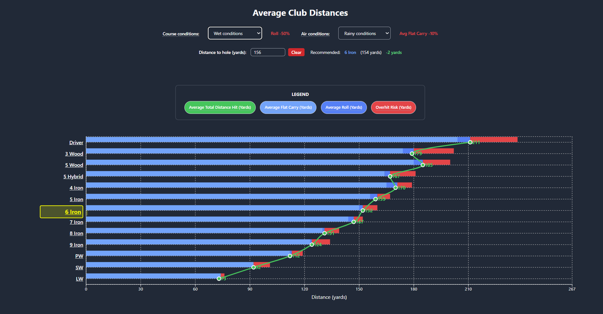

<p align="center">
  
</p>

<h1 align="center">Golf Shot Distances</h1>

<p align="center">
  <strong>Interactive golf distance planning app</strong> for tracking clubs, visualizing yardage breakdowns, and recommending club selection based on conditions.
</p>

<p align="center">
  <a href="https://golf-shot-distances.netlify.app">🌐 Live Demo</a> •
  <a href="https://github.com/bangsluke/golf-shot-distances">💻 GitHub Repository</a> •
  <a href="#key-features">✨ Features</a> •
  <a href="#tech-stack">🛠️ Tech Stack</a> •
  <a href="#architecture">🏗️ Architecture</a> •
  <a href="#quick-start">📚 Quick Start</a>
</p>

<p align="center">
  <a href="https://app.netlify.com/projects/golf-shot-distances/deploys" style="text-decoration: none;">
    
  </a>
  
  
  
  
  
</p>

<p align="center">
  
</p>

## Table of Contents

- [Table of Contents](#table-of-contents)
- [Project Overview](#project-overview)
- [Key Features](#key-features)
- [Tech Stack](#tech-stack)
- [Architecture](#architecture)
- [Quick Start](#quick-start)
  - [Development Start](#development-start)
  - [Production Build and Preview](#production-build-and-preview)
- [Configuration](#configuration)
  - [Environment Variables](#environment-variables)
  - [Google Sheets Setup](#google-sheets-setup)
- [API Endpoints](#api-endpoints)
  - [Production API (`netlify/functions/api.js`)](#production-api-netlifyfunctionsapijs)
  - [Local Development API (`backend/index.js`)](#local-development-api-backendindexjs)
  - [Mock/Test API (`netlify/functions/api-simple.js`)](#mocktest-api-netlifyfunctionsapi-simplejs)
- [Project Structure](#project-structure)
- [PWA Notes](#pwa-notes)
- [Troubleshooting](#troubleshooting)
- [Security Notes](#security-notes)

## Project Overview

Golf Shot Distances is a React + TypeScript app for managing golf club data and making faster distance decisions on the course.

The app pulls club data from Google Sheets, calculates and visualizes distance components (flat carry, roll, and overhit risk), and recommends a club for a given yardage while accounting for selected course and air conditions.

> [Back to Table of Contents](#table-of-contents)

## Key Features

- **Distance visualization**: Vertical composed chart with stacked distance bars and total-distance trend line.
- **Condition-aware planning**: Adjustments for dry/wet course conditions and normal/rainy/windy air conditions.
- **Club recommendation**: Suggests the nearest club for entered distance and highlights it in the chart.
- **Interactive editing**: Add, edit, and delete clubs using an in-app modal with calculated-field support.
- **Mobile-friendly behavior**: Touch-friendly controls, responsive chart sizing, and mobile pinned tooltips.
- **Legend and tooltips**: Rich metric explanations for carry, roll, total distance, and overhit risk.
- **PWA-ready build**: Manifest and service worker configured through `vite-plugin-pwa`.

> [Back to Table of Contents](#table-of-contents)

## Tech Stack

**Frontend**
- **React 18** with functional components and hooks
- **TypeScript** for static typing
- **Vite** for dev/build tooling
- **Recharts** for chart rendering
- **Tailwind CSS** for utility-first styling
- **Axios** for API requests

**Backend and Data**
- **Google Sheets API** as the persistent data store
- **Netlify Functions** for production serverless API routes
- **Express backend** (local) for full CRUD development workflow

**Deployment**
- **Netlify** for hosting, redirects, and serverless function runtime
- **Vite PWA Plugin** for installable app experience

> [Back to Table of Contents](#table-of-contents)

## Architecture

The app uses a simple frontend + API + Google Sheets architecture:

```
┌──────────────────────────────────────────────────────────┐
│                  Frontend (React + Vite)                │
│  Chart UI + club editor + recommendation logic          │
└───────────────────────────┬──────────────────────────────┘
                            │ HTTP (/api/clubs)
                            ▼
┌──────────────────────────────────────────────────────────┐
│                    API Layer                            │
│  - Netlify function (production)                        │
│  - Express server on localhost:4000 (local dev)         │
└───────────────────────────┬──────────────────────────────┘
                            │ Google Sheets API
                            ▼
┌──────────────────────────────────────────────────────────┐
│                   Google Sheets                          │
│  Club rows (distance fields, metadata, comments, order) │
└──────────────────────────────────────────────────────────┘
```

> [Back to Table of Contents](#table-of-contents)

## Quick Start

### Development Start

1. Install frontend dependencies:
   ```bash
   npm install
   ```
2. Install local backend dependencies:
   ```bash
   cd backend
   npm install
   cd ..
   ```
3. Start the local backend API (terminal 1):
   ```bash
   cd backend
   node index.js
   ```
4. Start the frontend (terminal 2):
   ```bash
   npm run dev
   ```
5. Open the app at `http://localhost:5173`.

The frontend expects local API requests at `http://localhost:4000/api/clubs` during development.

### Production Build and Preview

```bash
npm install
npm run build
npm run preview
```

> [Back to Table of Contents](#table-of-contents)

## Configuration

### Environment Variables

For **Netlify function** usage (`netlify/functions/api.js`), set:

```env
GOOGLE_SERVICE_ACCOUNT_KEY={"type":"service_account",...}
GOOGLE_SPREADSHEET_ID=your_google_sheet_id
GOOGLE_SHEET_TAB=your_sheet_tab_name
```

For **local backend** usage (`backend/index.js`), create `backend/.env` from `backend/.env.example`:

```env
GOOGLE_SERVICE_ACCOUNT_KEY_PATH=./service-account.json
GOOGLE_SHEET_ID=your_google_sheet_id_here
GOOGLE_SHEET_TAB=your_google_sheet_name
PORT=4000
```

### Google Sheets Setup

1. Create a Google Sheet and use row 1 as headers.
2. Add club columns used by the app (club info, distance values, comments, order).
3. Create a Google Cloud service account and enable Google Sheets API.
4. Share the sheet with the service account email.
5. Provide credentials through environment variables (Netlify) or a local key file path (backend).

> [Back to Table of Contents](#table-of-contents)

## API Endpoints

### Production API (`netlify/functions/api.js`)

- `GET /api/clubs` - Fetch all clubs from Google Sheets.
- `PUT /api/clubs/:clubName` - Update an existing club row.

### Local Development API (`backend/index.js`)

- `GET /api/clubs` - Fetch clubs.
- `POST /api/clubs` - Create a new club.
- `PUT /api/clubs/:club` - Update a club.
- `DELETE /api/clubs/:club` - Delete a club.

### Mock/Test API (`netlify/functions/api-simple.js`)

- `GET /api-simple/clubs` - Returns mock club data for connectivity checks.

> [Back to Table of Contents](#table-of-contents)

## Project Structure

```text
golf-shot-distances/
├── src/
│   ├── App.tsx
│   ├── components/
│   └── index.css
├── public/
│   ├── Golf-Shot-Distances-Logo.png
│   └── Golf-Shot-Distances.png
├── netlify/
│   └── functions/
├── backend/
│   ├── index.js
│   └── .env.example
├── vite.config.ts
├── netlify.toml
└── package.json
```

> [Back to Table of Contents](#table-of-contents)

## PWA Notes

This project uses `vite-plugin-pwa` with:
- Auto-update service worker registration
- Manifest with standalone display mode
- `pwa-192x192.png` and `pwa-512x512.png` icon entries
- Included static assets such as `Golf-Shot-Distances-Logo.png`

> [Back to Table of Contents](#table-of-contents)

## Troubleshooting

- **App shows "Backend not available" in development**: confirm local API is running on port `4000`.
- **Google Sheets errors**: verify service account access, spreadsheet ID, and tab name.
- **Netlify 500 errors**: validate `GOOGLE_SERVICE_ACCOUNT_KEY`, `GOOGLE_SPREADSHEET_ID`, and `GOOGLE_SHEET_TAB`.
- **Build issues**: re-run `npm install`, then `npm run build`, and check linting with `npm run lint`.

> [Back to Table of Contents](#table-of-contents)

## Security Notes

- Never commit service-account credentials or `.env` files.
- Keep Google service account keys in secure environment variables.
- Rotate keys if you suspect exposure.
- Restrict service account permissions to only what is needed.

> [Back to Table of Contents](#table-of-contents)
<!-- Legacy README content retained for reference and hidden from rendered output.
<p align="center">
  
</p>

<h1 align="center">Golf Shot Distances</h1>

<p align="center">
  <strong>Interactive golf distance planning app</strong> for tracking clubs, visualizing yardage breakdowns, and recommending club selection based on conditions.
</p>

<p align="center">
  <a href="https://golf-shot-distances.netlify.app">🌐 Live Demo</a> •
  <a href="https://github.com/bangsluke/golf-shot-distances">💻 GitHub Repository</a> •
  <a href="#key-features">✨ Features</a> •
  <a href="#tech-stack">🛠️ Tech Stack</a> •
  <a href="#architecture">🏗️ Architecture</a> •
  <a href="#quick-start">📚 Quick Start</a>
</p>

<p align="center">
  <a href="https://app.netlify.com/projects/golf-shot-distances/deploys" style="text-decoration: none;">
    
  </a>
  
  
  
  
  
</p>

<p align="center">
  
</p>

## Table of Contents

- [Table of Contents](#table-of-contents)
- [Project Overview](#project-overview)
- [Key Features](#key-features)
- [Tech Stack](#tech-stack)
- [Architecture](#architecture)
- [Quick Start](#quick-start)
  - [Development Start](#development-start)
  - [Production Build and Preview](#production-build-and-preview)
- [Configuration](#configuration)
  - [Environment Variables](#environment-variables)
  - [Google Sheets Setup](#google-sheets-setup)
- [API Endpoints](#api-endpoints)
- [Project Structure](#project-structure)
- [PWA Notes](#pwa-notes)
- [Troubleshooting](#troubleshooting)
- [Security Notes](#security-notes)

## Project Overview

Golf Shot Distances is a React + TypeScript app for managing golf club data and making faster distance decisions on the course.

The app pulls club data from Google Sheets, calculates and visualizes distance components (flat carry, roll, and overhit risk), and recommends a club for a given yardage while accounting for selected course and air conditions.

> [Back to Table of Contents](#table-of-contents)

## Key Features

- **Distance visualization**: Vertical composed chart with stacked distance bars and total-distance trend line.
- **Condition-aware planning**: Adjustments for dry/wet course conditions and normal/rainy/windy air conditions.
- **Club recommendation**: Suggests the nearest club for entered distance and highlights it in the chart.
- **Interactive editing**: Add, edit, and delete clubs using an in-app modal with calculated-field support.
- **Mobile-friendly behavior**: Touch-friendly controls, responsive chart sizing, and mobile pinned tooltips.
- **Legend and tooltips**: Rich metric explanations for carry, roll, total distance, and overhit risk.
- **PWA-ready build**: Manifest and service worker configured through `vite-plugin-pwa`.

> [Back to Table of Contents](#table-of-contents)

## Tech Stack

**Frontend**
- **React 18** with functional components and hooks
- **TypeScript** for static typing
- **Vite** for dev/build tooling
- **Recharts** for chart rendering
- **Tailwind CSS** for utility-first styling
- **Axios** for API requests

**Backend and Data**
- **Google Sheets API** as the persistent data store
- **Netlify Functions** for production serverless API routes
- **Express backend** (local) for full CRUD development workflow

**Deployment**
- **Netlify** for hosting, redirects, and serverless function runtime
- **Vite PWA Plugin** for installable app experience

> [Back to Table of Contents](#table-of-contents)

## Architecture

The app uses a simple frontend + API + Google Sheets architecture:

```
┌──────────────────────────────────────────────────────────┐
│                  Frontend (React + Vite)                │
│  Chart UI + club editor + recommendation logic          │
└───────────────────────────┬──────────────────────────────┘
                            │ HTTP (/api/clubs)
                            ▼
┌──────────────────────────────────────────────────────────┐
│                    API Layer                            │
│  - Netlify function (production)                        │
│  - Express server on localhost:4000 (local dev)         │
└───────────────────────────┬──────────────────────────────┘
                            │ Google Sheets API
                            ▼
┌──────────────────────────────────────────────────────────┐
│                   Google Sheets                          │
│  Club rows (distance fields, metadata, comments, order) │
└──────────────────────────────────────────────────────────┘
```

> [Back to Table of Contents](#table-of-contents)

## Quick Start

### Development Start

1. Install frontend dependencies:
   ```bash
   npm install
   ```
2. Install local backend dependencies:
   ```bash
   cd backend
   npm install
   cd ..
   ```
3. Start the local backend API (terminal 1):
   ```bash
   cd backend
   node index.js
   ```
4. Start the frontend (terminal 2):
   ```bash
   npm run dev
   ```
5. Open the app at `http://localhost:5173`.

The frontend expects local API requests at `http://localhost:4000/api/clubs` during development.

### Production Build and Preview

```bash
npm install
npm run build
npm run preview
```

> [Back to Table of Contents](#table-of-contents)

## Configuration

### Environment Variables

For **Netlify function** usage (`netlify/functions/api.js`), set:

```env
GOOGLE_SERVICE_ACCOUNT_KEY={"type":"service_account",...}
GOOGLE_SPREADSHEET_ID=your_google_sheet_id
GOOGLE_SHEET_TAB=your_sheet_tab_name
```

For **local backend** usage (`backend/index.js`), create `backend/.env` from `backend/.env.example`:

```env
GOOGLE_SERVICE_ACCOUNT_KEY_PATH=./service-account.json
GOOGLE_SHEET_ID=your_google_sheet_id_here
GOOGLE_SHEET_TAB=your_google_sheet_name
PORT=4000
```

### Google Sheets Setup

1. Create a Google Sheet and use row 1 as headers.
2. Add club columns used by the app (club info, distance values, comments, order).
3. Create a Google Cloud service account and enable Google Sheets API.
4. Share the sheet with the service account email.
5. Provide credentials through environment variables (Netlify) or a local key file path (backend).

> [Back to Table of Contents](#table-of-contents)

## API Endpoints

### Production API (`netlify/functions/api.js`)

- `GET /api/clubs` - Fetch all clubs from Google Sheets.
- `PUT /api/clubs/:clubName` - Update an existing club row.

### Local Development API (`backend/index.js`)

- `GET /api/clubs` - Fetch clubs.
- `POST /api/clubs` - Create a new club.
- `PUT /api/clubs/:club` - Update a club.
- `DELETE /api/clubs/:club` - Delete a club.

### Mock/Test API (`netlify/functions/api-simple.js`)

- `GET /api-simple/clubs` - Returns mock club data for connectivity checks.

> [Back to Table of Contents](#table-of-contents)

## Project Structure

```text
golf-shot-distances/
├── src/
│   ├── App.tsx
│   ├── components/
│   └── index.css
├── public/
│   ├── Golf-Shot-Distances-Logo.png
│   └── Golf-Shot-Distances.png
├── netlify/
│   └── functions/
├── backend/
│   ├── index.js
│   └── .env.example
├── vite.config.ts
├── netlify.toml
└── package.json
```

> [Back to Table of Contents](#table-of-contents)

## PWA Notes

This project uses `vite-plugin-pwa` with:
- Auto-update service worker registration
- Manifest with standalone display mode
- `pwa-192x192.png` and `pwa-512x512.png` icon entries
- Included static assets such as `Golf-Shot-Distances-Logo.png`

> [Back to Table of Contents](#table-of-contents)

## Troubleshooting

- **App shows "Backend not available" in development**: confirm local API is running on port `4000`.
- **Google Sheets errors**: verify service account access, spreadsheet ID, and tab name.
- **Netlify 500 errors**: validate `GOOGLE_SERVICE_ACCOUNT_KEY`, `GOOGLE_SPREADSHEET_ID`, and `GOOGLE_SHEET_TAB`.
- **Build issues**: re-run `npm install`, then `npm run build`, and check linting with `npm run lint`.

> [Back to Table of Contents](#table-of-contents)

## Security Notes

- Never commit service-account credentials or `.env` files.
- Keep Google service account keys in secure environment variables.
- Rotate keys if you suspect exposure.
- Restrict service account permissions to only what is needed.

> [Back to Table of Contents](#table-of-contents)
<p align="center">
  
</p>

# Golf Shot Distances

[](https://app.netlify.com/projects/golf-shot-distances/deploys)

A React-based web application that displays and manages golf club shot distances. The app connects to a Google Sheets backend to store and retrieve club data, making it easy to track your golf performance across different clubs.

## Table of Contents
- [Table of Contents](#table-of-contents)
- [Quick Start](#quick-start)
  - [Development Mode](#development-mode)
  - [Production Mode](#production-mode)
- [Complete Setup Guide](#complete-setup-guide)
  - [Prerequisites](#prerequisites)
  - [Step 1: Clone the Repository](#step-1-clone-the-repository)
  - [Step 2: Set Up Google Sheets](#step-2-set-up-google-sheets)
  - [Step 3: Configure Google Cloud API](#step-3-configure-google-cloud-api)
  - [Step 4: Set Up Environment Variables](#step-4-set-up-environment-variables)
  - [Step 5: Test Your Setup](#step-5-test-your-setup)
  - [Step 6: Deploy to GitHub](#step-6-deploy-to-github)
  - [Step 7: Deploy to Netlify](#step-7-deploy-to-netlify)
  - [Step 8: Customize Your App](#step-8-customize-your-app)
- [Project Structure](#project-structure)
- [PWA and Add to Home Screen (iOS)](#pwa-and-add-to-home-screen-ios)
  - [PWA icons](#pwa-icons)
- [Troubleshooting](#troubleshooting)
  - [Common Issues](#common-issues)
  - [Getting Help](#getting-help)
  - [Security Notes](#security-notes)

## Quick Start

### Development Mode

To run the application in development mode:

```bash
# Install dependencies
npm install

# Start the development server
npm run dev
```

The app will be available at `http://localhost:5173` (or the port shown in your terminal).

> [Back to Table of Contents](#table-of-contents)

### Production Mode

To build and preview the production version:

```bash
# Install dependencies
npm install

# Build the application
npm run build

# Preview the production build
npm run preview
```

> [Back to Table of Contents](#table-of-contents)

## Complete Setup Guide

This guide will walk you through setting up your own Golf Shot Distances website from scratch.

### Prerequisites

Before starting, make sure you have:
- [Node.js](https://nodejs.org/) (version 18 or higher)
- [Git](https://git-scm.com/) installed
- A [GitHub](https://github.com/) account
- A [Netlify](https://netlify.com/) account
- A [Google Cloud](https://console.cloud.google.com/) account
- A modern web browser (Chrome, Firefox, Safari, or Edge)

> [Back to Table of Contents](#table-of-contents)

### Step 1: Clone the Repository

1. **Fork the repository** (if it's public) or create a new repository on GitHub
2. **Clone the repository** to your local machine:
   ```bash
   git clone https://github.com/yourusername/golf-shot-distances.git
   cd golf-shot-distances
   ```
3. **Install dependencies**:
   ```bash
   npm install
   ```
4. **Verify installation**:
   ```bash
   npm run dev
   ```
   - You should see a development server starting
   - The app will open in your browser (though it won't have data yet)

> [Back to Table of Contents](#table-of-contents)

### Step 2: Set Up Google Sheets

1. **Create a new Google Sheet**:
   - Go to [Google Sheets](https://sheets.google.com/)
   - Create a new spreadsheet
   - Name it something like "Golf Shot Distances"

2. **Set up the data structure**:
   - In the first row, add these headers:
     ```
     Club | Average Flat Carry (Yards) | Average Roll (Yards) | Overhit Risk (Yards) | Average Total Distance Hit (Yards) | Notes
     ```
   - Add your club data. Here's an example structure:
     ```
     Driver | 250 | 20 | 15 | 270 | My driver with good contact
     3 Wood | 220 | 15 | 10 | 235 | Fairway wood for long approaches
     5 Iron | 180 | 10 | 8 | 190 | Mid-iron for approach shots
     7 Iron | 150 | 8 | 6 | 158 | Short iron for approach shots
     Putter | 0 | 0 | 0 | 0 | For putting only
     ```
   - **Note**: You can use data from a TopTracer driving range or any other golf tracking system
   - **Tip**: Make sure all numeric values are actually numbers, not text

3. **Get the Spreadsheet ID**:
   - Look at the URL of your Google Sheet
   - The ID is the long string between `/d/` and `/edit`
   - Example: `https://docs.google.com/spreadsheets/d/1ABC123DEF456GHI789/edit#gid=0`
   - The ID would be: `1ABC123DEF456GHI789`
   - **Save this ID** - you'll need it later

> [Back to Table of Contents](#table-of-contents)

### Step 3: Configure Google Cloud API

1. **Create a Google Cloud Project**:
   - Go to [Google Cloud Console](https://console.cloud.google.com/)
   - Click "Select a project" → "New Project"
   - Name your project (e.g., "Golf Shot Distances")
   - Click "Create"
   - **Note**: Make sure to select the new project after creation

2. **Enable Google Sheets API**:
   - In your project, go to "APIs & Services" → "Library"
   - Search for "Google Sheets API"
   - Click on it and press "Enable"
   - Wait for the API to be enabled (you'll see a green checkmark)

3. **Create a Service Account**:
   - Go to "APIs & Services" → "Credentials"
   - Click "Create Credentials" → "Service Account"
   - Fill in the details:
     - Name: "Golf Shot Distances Service Account"
     - Description: "Service account for golf shot distances app"
   - Click "Create and Continue"
   - Skip the optional steps and click "Done"

4. **Generate Service Account Key**:
   - Click on your newly created service account
   - Go to the "Keys" tab
   - Click "Add Key" → "Create new key"
   - Choose "JSON" format
   - Click "Create"
   - The JSON file will download automatically
   - **Important**: Keep this file secure and don't share it

5. **Share the Google Sheet**:
   - Open your Google Sheet
   - Click "Share" (top right)
   - Add the service account email (found in the JSON file under `client_email`)
   - Give it "Editor" permissions
   - Click "Send"
   - **Verify**: The service account email should appear in the sharing list

> [Back to Table of Contents](#table-of-contents)

### Step 4: Set Up Environment Variables

1. **For Local Development**:
   - Create a `.env` file in the root directory:
     ```env
     VITE_GOOGLE_SERVICE_ACCOUNT_KEY={"type":"service_account","project_id":"your-project-id",...}
     VITE_GOOGLE_SPREADSHEET_ID=your-spreadsheet-id-here
     ```
   - Replace the values with your actual data:
     - Copy the entire content of your downloaded JSON file for `VITE_GOOGLE_SERVICE_ACCOUNT_KEY`
     - Use your spreadsheet ID for `VITE_GOOGLE_SPREADSHEET_ID`
   - **Important**: Make sure there are no extra spaces or line breaks in the JSON

2. **For Netlify Deployment** (we'll set this up later):
   - You'll add these same variables in the Netlify dashboard

3. **Add .env to .gitignore** (if not already there):
   - Check that `.env` is listed in your `.gitignore` file
   - This prevents your sensitive data from being committed to Git

> [Back to Table of Contents](#table-of-contents)

### Step 5: Test Your Setup

1. **Test Local Development**:
   ```bash
   npm run dev
   ```
   - Open your browser to the development server
   - Check the browser console for any errors
   - The app should load and display your golf club data

2. **Test Data Loading**:
   - If data doesn't load, check:
     - Browser console for errors
     - That your `.env` file is in the root directory
     - That the service account has access to the spreadsheet
     - That the spreadsheet ID is correct

3. **Test Data Updates** (if the app supports editing):
   - Try updating a club's distance
   - Check that the changes appear in your Google Sheet

> [Back to Table of Contents](#table-of-contents)

### Step 6: Deploy to GitHub

1. **Initialize Git** (if not already done):
   ```bash
   git init
   git add .
   git commit -m "Initial commit"
   ```

2. **Create a new repository on GitHub**:
   - Go to [GitHub](https://github.com/)
   - Click "New repository"
   - Name it "golf-shot-distances"
   - Make it public or private (your choice)
   - Don't initialize with README (since you already have one)
   - Click "Create repository"

3. **Push to GitHub**:
   ```bash
   git remote add origin https://github.com/yourusername/golf-shot-distances.git
   git branch -M main
   git push -u origin main
   ```

4. **Verify the push**:
   - Go to your GitHub repository
   - You should see all your files there
   - **Important**: Make sure `.env` is NOT in the repository (it should be ignored)

> [Back to Table of Contents](#table-of-contents)

### Step 7: Deploy to Netlify

1. **Connect to Netlify**:
   - Go to [Netlify](https://netlify.com/)
   - Sign in with your GitHub account
   - Click "New site from Git"
   - Choose "GitHub" and select your repository

2. **Configure Build Settings**:
   - Build command: `npm run build`
   - Publish directory: `dist`
   - Click "Deploy site"

3. **Set Environment Variables**:
   - In your Netlify dashboard, go to "Site settings" → "Environment variables"
   - Add the following variables:
     ```
     GOOGLE_SERVICE_ACCOUNT_KEY = {"type":"service_account","project_id":"your-project-id",...}
     GOOGLE_SPREADSHEET_ID = your-spreadsheet-id-here
     ```
   - Use the same values from your local `.env` file
   - **Important**: Make sure to use the exact same format as your local `.env` file

4. **Redeploy**:
   - Go to "Deploys" tab
   - Click "Trigger deploy" → "Deploy site"
   - Wait for the deployment to complete

5. **Test the Live Site**:
   - Visit your Netlify URL
   - Test that the data loads correctly
   - Check for any console errors

Your site should now be live at `https://your-site-name.netlify.app`!

> [Back to Table of Contents](#table-of-contents)

### Step 8: Customize Your App

1. **Update the Title and Description**:
   - Edit `index.html` to change the page title
   - Update the README with your own information

2. **Customize the Styling**:
   - Modify `src/index.css` for global styles
   - Update `src/App.css` for component-specific styles
   - The app uses Tailwind CSS, so you can add Tailwind classes

3. **Add More Features**:
   - Consider adding more golf clubs
   - Add different shot types (draw, fade, etc.)
   - Include weather conditions
   - Add a scoring system

4. **Set Up Custom Domain** (Optional):
   - In Netlify, go to "Domain settings"
   - Add your custom domain
   - Follow the DNS configuration instructions

> [Back to Table of Contents](#table-of-contents)

## Project Structure

```
golf-shot-distances/
├── src/                    # React source code
│   ├── components/         # React components
│   ├── App.tsx            # Main application component
│   └── main.tsx           # Application entry point
├── netlify/
│   └── functions/         # Netlify serverless functions
├── public/                # Static assets
├── backend/               # Local development backend
├── package.json           # Dependencies and scripts
├── netlify.toml          # Netlify configuration
├── .env                   # Environment variables (not in Git)
└── .gitignore            # Git ignore rules
```

> [Back to Table of Contents](#table-of-contents)

## PWA and Add to Home Screen (iOS)

The site is configured as a PWA and can be added to the iOS home screen. The manifest and service worker are generated at build time. For a proper home screen icon and install experience, add the following icon files to the `public/` folder:

### PWA icons

| File | Size | Purpose |
|------|------|---------|
| `pwa-192x192.png` | 192×192 px | Web app manifest |
| `pwa-512x512.png` | 512×512 px | Web app manifest |
| `Golf-Shot-Distances-Logo.png` | 180×180 px recommended | iOS home screen icon |

Generate these from a single high-resolution PNG or SVG using [PWA Assets Generator](https://vite-pwa-org.netlify.app/assets-generator/) or [PWA Builder Image Generator](https://www.pwabuilder.com/imageGenerator), then place the files in `public/`. Until these exist, the app still builds; the home screen may show a default icon.

> [Back to Table of Contents](#table-of-contents)

## Troubleshooting

### Common Issues

1. **"Cannot read properties of undefined" errors**:
   - Check that your environment variables are set correctly
   - Verify the Google Sheets API is enabled
   - Ensure the service account has access to the spreadsheet
   - Check that the JSON key is properly formatted

2. **502 Bad Gateway errors**:
   - Check Netlify function logs in the dashboard
   - Verify environment variables are set in Netlify
   - Make sure the service account JSON is properly formatted
   - Check that the Google Sheets API is enabled

3. **Data not loading**:
   - Check the browser console for errors
   - Verify the spreadsheet ID is correct
   - Ensure the spreadsheet has the correct column headers
   - Check that the service account has editor permissions

4. **Build failures**:
   - Make sure all dependencies are installed: `npm install`
   - Check for TypeScript errors: `npm run lint`
   - Verify Node.js version is 18 or higher

5. **Environment variable issues**:
   - Make sure `.env` file is in the root directory
   - Check that variable names start with `VITE_` for local development
   - Verify JSON is properly escaped in environment variables

> [Back to Table of Contents](#table-of-contents)

### Getting Help

- Check the browser console for JavaScript errors
- Review Netlify function logs in your dashboard
- Verify all environment variables are correctly set
- Test the Google Sheets API access manually
- Check the Google Cloud Console for API usage and errors
- Review the Netlify deployment logs for build issues

> [Back to Table of Contents](#table-of-contents)

### Security Notes

- Never commit your service account key to version control
- Use environment variables for all sensitive data
- Regularly rotate your service account keys
- Monitor API usage to avoid unexpected charges
- Keep your Google Cloud project secure
- Consider setting up API quotas to prevent abuse

> [Back to Table of Contents](#table-of-contents)

---

**Happy golfing! 🏌️‍♂️**
-->
